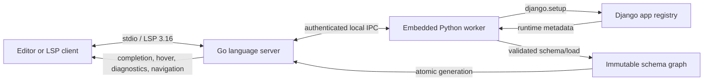

<p align="center">
  
</p>

<h1 align="center">Pogo</h1>

<p align="center">
  <strong>Runtime-accurate Django ORM intelligence for your editor.</strong><br>
  Pogo boots the Django project you actually run, builds an immutable schema graph,
  and serves completion, diagnostics, hover, signatures, and navigation from a fast Go LSP.
</p>

<p align="center">
  <a href="https://github.com/amirhasanzadehpy/Pogo/actions/workflows/ci.yml"></a>
  <a href="https://github.com/amirhasanzadehpy/Pogo/releases/tag/v0.1.0"></a>
  
  
  
</p>

<p align="center">
  <a href="#quick-start">Quick start</a> |
  <a href="#what-pogo-adds">Features</a> |
  <a href="#performance">Performance</a> |
  <a href="#editor-setup">Editors</a> |
  <a href="#how-it-works">Architecture</a> |
  <a href="https://github.com/amirhasanzadehpy/Pogo/releases">Releases</a>
</p>

## Why Pogo

Django's real schema is created at runtime. Installed apps, abstract fields,
custom managers, `QuerySet` methods, database-specific lookups, reverse
relations, and project settings all affect what the ORM can do. Static stubs
alone cannot see the complete result.

Pogo combines both sides:

- **Django supplies truth.** An embedded Python worker runs `django.setup()` in
  your selected environment and reads the model registry Django initialized.
- **Go keeps editing responsive.** The validated schema is indexed once and
  atomically swapped into an in-process graph. Editor requests do not invoke
  Python on the hot path.
- **Analysis stays conservative.** Pogo understands static model values and ORM
  paths without pretending to be a general Python type checker.

Pogo is designed to run beside Pyright, BasedPyright, Ruff, or another general
Python tool, not replace it.

## What Pogo Adds

| Capability | Django-aware behavior |
| --- | --- |
| **Completion** | Fields, foreign-key attnames, relations, reverse names, lookups, transforms, managers, and custom `QuerySet` methods |
| **ORM paths** | `filter`, `exclude`, `get`, `values`, `values_list`, `only`, `defer`, `select_related`, and `prefetch_related` |
| **Hover** | Django field class, database type and column, nullability, `db_index`, uniqueness, relation targets, and field help text |
| **Signature help** | Cached signatures and docstrings for custom manager and `QuerySet` methods |
| **Diagnostics** | Exact invalid path segments, non-relation traversal, invalid lookups, projections, and `select_related` targets |
| **Navigation** | Exact definitions for models, fields, relation strings, reverse accessors, managers, custom methods, and individual path segments |
| **Schema refresh** | Debounced reloads, atomic graph replacement, and last-valid-schema fallback when a refresh fails |

## Performance

<p align="center">
  
</p>

The current reference profile keeps every plotted interaction workload below
`1 ms` p95, including dense relation completion and a batch of 100 invalid
expressions. Larger document-update and snapshot workloads are measured
separately in the full profile.

| Workload | Scope | p95 |
| --- | --- | ---: |
| Hover | Loaded-cache handler | `3.50 us` |
| Completion in a 10,000-model graph | Selected imported model; graph already built | `4.75 us` |
| Diagnostics | Incremental edit, parse, analysis, and publish | `15.75 us` |
| Definition | Loaded-cache handler | `28.33 us` |
| Completion | Incremental edit, parse, and handler | `58.67 us` |
| Dense relation completion | 256 completion candidates | `496.80 us` |
| Diagnostic scale | 100 invalid ORM expressions | `653.00 us` |

| Release gate | Observed | Budget |
| --- | ---: | ---: |
| Completion p95 | `58.67 us` | `< 10,000 us` |
| Go server idle RSS | `19.67 MiB` | `<= 50 MiB` |
| Combined Go + Python idle RSS | `67.55 MiB` | `<= 150 MiB` |

Reference profile: tracked source at `ca86c19`, captured July 31, 2026 on an
Apple M1 with macOS 26.5.2, Go 1.22.12, Python 3.11.10, and Django 5.2.16.
Timings are synthetic in-process benchmarks with 200 samples unless stated
otherwise; editor transport, process startup, and Django schema loading are not
included. Memory is the maximum observed idle RSS over 20 aligned samples, not
process-lifetime peak memory. Results vary by machine and project.

Run the same release-gated profile locally:

```sh
make fixture-env
make bench
```

See [Performance Profiles](DEV.md#performance-profiles) for the full benchmark
matrix, methodology, profiling commands, and CI artifact layout.

## Quick Start

The shortest supported path is a release binary plus the first-party VS Code
extension.

### 1. Install The Server

Download the archive for your OS and CPU from
[GitHub Releases](https://github.com/amirhasanzadehpy/Pogo/releases). Every
release includes Linux, macOS, and Windows builds for `amd64` and `arm64`, plus
`checksums.txt`.

The commands below use common architectures as examples. Replace `amd64` with
`arm64`, and `linux` with `darwin`, to match the archive you downloaded.

Linux and macOS archives contain one `pogo` executable:

```sh
tar -xzf pogo-v0.1.0-linux-amd64.tar.gz  # use darwin and/or arm64 when needed
mkdir -p "$HOME/.local/bin"
install -m 0755 pogo "$HOME/.local/bin/pogo"
export PATH="$HOME/.local/bin:$PATH"
pogo -version
```

Add `export PATH="$HOME/.local/bin:$PATH"` to `~/.profile`, `~/.zprofile`, or
your shell's equivalent to keep the command available after restarting.

Windows PowerShell:

The example uses `windows-amd64`; substitute `windows-arm64` in both commands on
Windows on Arm.

```powershell
Expand-Archive .\pogo-v0.1.0-windows-amd64.zip -DestinationPath .\pogo
$PogoBin = Join-Path $HOME ".local\bin"
New-Item -ItemType Directory -Force $PogoBin | Out-Null
Copy-Item .\pogo\pogo.exe "$PogoBin\pogo.exe"

$UserPath = [Environment]::GetEnvironmentVariable("Path", "User")
if (($UserPath -split ";") -notcontains $PogoBin) {
    [Environment]::SetEnvironmentVariable("Path", "$PogoBin;$UserPath", "User")
}
$env:Path = "$PogoBin;$env:Path"
pogo.exe -version
```

<details>
<summary>Download with GitHub CLI and verify checksums</summary>

This repository is private, so authenticate `gh` before downloading:

```sh
gh auth login
gh release download v0.1.0 \
  --repo amirhasanzadehpy/Pogo \
  --pattern 'pogo-v0.1.0-linux-amd64.tar.gz' \
  --pattern checksums.txt
sha256sum --check --ignore-missing checksums.txt
```

Change the `--pattern` target to match your OS and CPU. On macOS, download the
matching `darwin` archive and calculate its digest with
`shasum -a 256 pogo-v0.1.0-darwin-arm64.tar.gz` and compare it with the matching
line in `checksums.txt`. On Windows, use:

```powershell
Get-FileHash .\pogo-v0.1.0-windows-amd64.zip -Algorithm SHA256
```

</details>

### 2. Install The VS Code Extension

Download `pogo-0.1.0.vsix` from the same release, then run:

```sh
code --install-extension "$HOME/Downloads/pogo-0.1.0.vsix"
```

You can also run **Extensions: Install from VSIX...** from the command palette.
Reload VS Code after installation.

### 3. Open A Django Project

Open the trusted workspace containing `manage.py`, then open a Python file. By
default Pogo discovers:

- The workspace folder as the project root.
- An active `VIRTUAL_ENV`, then the project's `.venv`.
- `DJANGO_SETTINGS_MODULE`, the literal setting in `manage.py`, or one
  unambiguous immediate `*/settings.py`.

The selected interpreter must already contain Django and every dependency your
project imports during `django.setup()`.

### 4. Verify ORM Intelligence

Request completion while typing a relation path:

```python
from shop.models import Order

orders = Order.objects.filter(
    customer__address__city__icontains="York",
)
```

Pogo should complete each path segment, show field and lookup hover details,
navigate to model definitions, and diagnose misspelled paths.

## Everyday Usage

### Complete The ORM You Already Write

Pogo changes suggestions to match the API context:

```python
# Query names, transforms, and terminal lookups.
Order.objects.filter(customer__email__iexact=email)

# Projection paths.
Order.objects.values("customer__email", "total")

# Only single-valued relations are offered here.
Order.objects.select_related("customer__profile")

# Reverse accessors and collection relations are valid here.
Order.objects.prefetch_related("items__product")
```

Inside `@admin.register(Model)` admin classes, Pogo also follows
`super().get_queryset(...)` chains for related-loading completion and
navigation.

The VS Code extension retriggers suggestions after `__` is typed inside a
single-line Python string, working around VS Code's disabled-by-default quick
suggestions in strings.

Lookup suggestions come from the active Django field registry. Pogo also checks
the default database's JSON containment capability and omits `contains` and
`contained_by` when that backend does not support them.

### Catch Broken Paths Before Runtime

```python
# "adress" is reported as django-orm.unknown-path-segment.
Order.objects.filter(customer__adress__city="York")
```

Diagnostics use the exact UTF-16 range for the bad segment. Pogo also detects
non-relation traversal, invalid transforms or lookups, invalid projection
paths, and invalid `select_related` targets.

### Understand Project APIs

Custom manager and `QuerySet` methods are introspected but never called. Hover
shows their cached class, signature, and docstring; signature help preserves
positional-only, keyword-only, variadic, and keyword arguments. Return
annotations help Pogo continue inference through custom chains.

### Navigate Schema-Backed Code

Go to definition works on model imports, fields, relation segments, reverse
accessors, managers, custom methods, and static `ForeignKey`, `OneToOneField`,
`ManyToManyField`, and `related_name` strings. Navigation includes the exact
target range when its source remains current.

### Refresh Without Blocking Editing

Saving Python under an installed Django app schedules a trailing-edge schema
refresh. A valid generation replaces the graph atomically. If Django fails to
reload, Pogo keeps the last valid graph and warns once, so editor features stay
available while you fix the project error.

## Editor Setup

| Editor | Integration | Status |
| --- | --- | --- |
| **VS Code** | Bundled language-client extension | First-party; one Pogo process per workspace folder |
| **Neovim 0.11.3+** | Built-in LSP API | Direct configuration; no separate Pogo plugin required |
| **Zed** | External command through a registered Python adapter | Temporary bridge until a native adapter exists |

### VS Code

Automatic discovery is enough for standard projects. For an unusual layout,
add only the required overrides to `.vscode/settings.json`:

```json
{
  "pogo.executablePath": "/absolute/path/to/pogo",
  "pogo.pythonPath": ".venv/bin/python",
  "pogo.settingsModule": "config.settings",
  "pogo.envFile": ".env",
  "pogo.environment": {
    "DEBUG": null
  }
}
```

Relative paths resolve from each workspace folder. Environment precedence is
extension host, dotenv file, then `pogo.environment`; `null` removes an
inherited value. Keep credentials in an ignored, permission-restricted dotenv
file rather than workspace settings.

Remote SSH, WSL, Dev Containers, and Codespaces run Pogo on the remote extension
host. Install the binary there, not only on the local desktop.

### Neovim

With current `nvim-lspconfig`:

```lua
vim.lsp.config("pogo", {
  cmd = { "pogo" },
  filetypes = { "python" },
  root_markers = { "manage.py", "pyproject.toml", ".git" },
})

vim.lsp.enable("pogo")
```

Use `init_options.djangoOrm.pythonPath` and
`init_options.djangoOrm.settingsModule` only when discovery is ambiguous. Run
`:checkhealth vim.lsp` to inspect the active root, command, and logs.

<details>
<summary>Zed bridge configuration</summary>

Zed cannot currently register a new language-server adapter from
`settings.json`. The available bridge replaces the command behind its `pyright`
slot with Pogo:

```jsonc
{
  "languages": {
    "Python": {
      "language_servers": ["pyright", "basedpyright", "..."]
    }
  },
  "lsp": {
    "pyright": {
      "binary": {
        "path": "/home/you/.local/bin/pogo",
        "arguments": [
          "-python", "/absolute/path/to/project/.venv/bin/python",
          "-settings", "config.settings"
        ]
      }
    }
  }
}
```

This starts Pogo, not Pyright, in that slot. Keep another registered Python
server such as BasedPyright enabled for general typing. Use escaped backslashes
for Windows JSON paths and restart language servers after changing arguments.

</details>

## How It Works



1. The editor initializes Pogo with a project root, interpreter, and optional
   settings module.
2. Pogo extracts its embedded Python worker into a private temporary directory
   and starts it with a random 256-bit authentication token.
3. The worker runs Django and returns fields, relations, managers, custom
   methods, indexes, constraints, source ranges, and backend-aware lookups.
4. Go strictly validates the payload and builds indexed, immutable views.
5. Editor features read that graph directly. Python returns only for a schema
   refresh, not for each completion or hover request.

Unix systems use a private mode-0600 Unix socket. Windows uses authenticated
loopback TCP. IPC authentication protects the local endpoint; it is not a
sandbox for project code.

## Compatibility And Scope

| Python | Django 4.2 | Django 5.2 |
| ---: | :---: | :---: |
| 3.10 | Tested | Tested |
| 3.11 | Tested | Tested |
| 3.12 | Tested | Tested |
| 3.13 | Not supported upstream | Tested |

Release binaries target Linux, macOS, and Windows on `amd64` and `arm64`.

Pogo deliberately favors false negatives over false positives. It recognizes
direct, aliased, and qualified model imports; model constructors; assignments;
model annotations; `QuerySet[Model]`; selected manager/query chains; and
annotated parameters. Dynamic filters, `**kwargs`, f-strings, concatenated
paths, unresolved receivers, and unsafe rebinding are generally left alone.

Pogo does not provide general Python typing, rename, references, formatting,
imports, code actions, or workspace symbols. Keep your existing Python language
server and formatter enabled.

## Configuration

| Need | VS Code | LSP initialization | CLI |
| --- | --- | --- | --- |
| Project root | Workspace folder | `djangoOrm.projectRoot` | `-project PATH` |
| Python interpreter | `pogo.pythonPath` | `djangoOrm.pythonPath` | `-python PATH` |
| Settings module | `pogo.settingsModule` | `djangoOrm.settingsModule` | `-settings MODULE` |
| Environment file | `pogo.envFile` | Client-managed | Client-managed |
| Logs | Pogo output channel | Client stderr | `-log-file PATH` |

<details>
<summary>Automatic resolution order</summary>

Project root:

1. `-project`
2. `djangoOrm.projectRoot`
3. The sole workspace folder
4. LSP `rootUri`
5. Legacy `rootPath`

Python interpreter:

1. `-python`
2. `djangoOrm.pythonPath`
3. Active `VIRTUAL_ENV`
4. Project `.venv`
5. `python3` on `PATH`

Django settings:

1. `-settings`
2. `djangoOrm.settingsModule`
3. `DJANGO_SETTINGS_MODULE`
4. A literal `os.environ.setdefault(...)` value in `manage.py`
5. One unambiguous immediate `*/settings.py`

Ambiguous settings fail with an actionable error instead of an arbitrary guess.

</details>

## Troubleshooting

| Symptom | Check |
| --- | --- |
| Editor cannot find Pogo | Run `pogo -version` from the editor host, or configure an absolute executable path |
| ORM results are empty | Confirm the selected interpreter can import Django, the project, and its dependencies |
| Results are stale after a save | Check the Pogo output/log for a failed Django refresh; the last valid graph remains active |
| Wrong virtual environment | Clear the inherited `VIRTUAL_ENV` or set the editor's explicit Python path |
| Multiple projects in one window | Use one LSP root per project; VS Code creates one client per workspace folder automatically |

Desktop applications on macOS may not inherit your shell `PATH`. Configure
`pogo.executablePath` or start VS Code from a terminal. If Gatekeeper blocks a
verified binary, approve it in **System Settings > Privacy & Security** or run
`xattr -d com.apple.quarantine ~/.local/bin/pogo` after checking its digest.

## Build And Contribute

Building from source requires Git, Go 1.22 or newer, Python 3.10-3.13, and GNU
Make on Linux or macOS:

```sh
git clone https://github.com/amirhasanzadehpy/Pogo.git
cd Pogo
make fixture-env
make build
make test
./build/pogo -version
```

Useful development gates:

```sh
make test-race      # race-enabled Go suite
make compat         # pinned Django 4.2 and 5.2 fixtures
make bench          # profile plus release performance gates
make release-check  # inspect production dependencies and embedded imports
```

| Directory | Responsibility |
| --- | --- |
| `cmd/pogo` | CLI, configuration, logging, and server wiring |
| `internal/lsp` | LSP lifecycle, capabilities, handlers, diagnostics, and navigation |
| `internal/analysis` | Tree-sitter parsing, document state, model inference, and ORM paths |
| `internal/schema` | DTO validation, indexed graph views, and atomic cache generations |
| `internal/python` | Worker supervision, authentication, refresh, and transport |
| `src/daemon` | Embedded Django introspection worker |
| `client/vscode` | First-party VS Code language client |

See [DEV.md](DEV.md) for protocol traces, schema inspection, fuzzing,
performance profiling, release inspection, and versioning.

## Security

Pogo starts Django, and `django.setup()` imports and executes code from the
project. That code has the editor process's access to files, databases,
services, credentials, and the network. Use Pogo only with trusted workspaces.
The VS Code extension is disabled in untrusted and virtual workspaces.

## Releases

Version tags are built only after the complete compatibility, race, native
transport, cross-build, and performance matrix passes. CI publishes six binary
archives, the VS Code VSIX, generated release notes, and `checksums.txt` to
[GitHub Releases](https://github.com/amirhasanzadehpy/Pogo/releases).

For bugs and feature requests, use
[GitHub Issues](https://github.com/amirhasanzadehpy/Pogo/issues).
