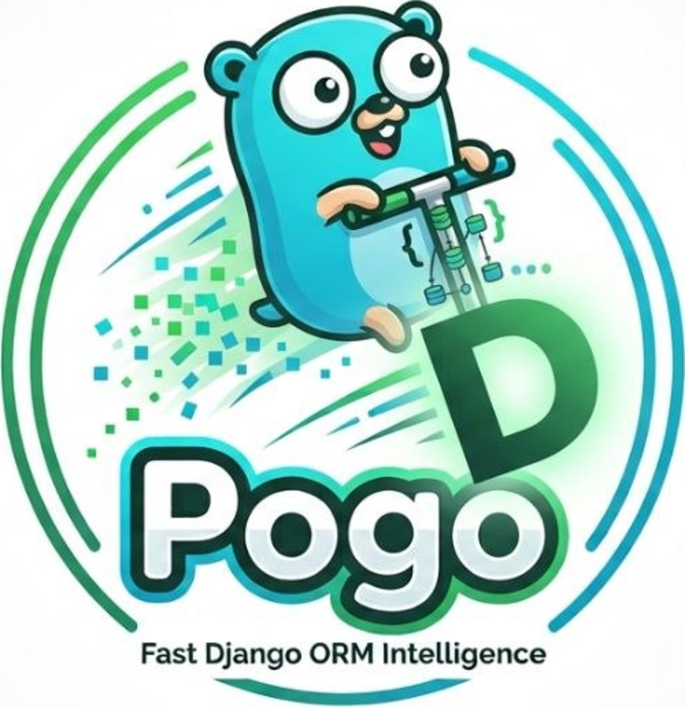
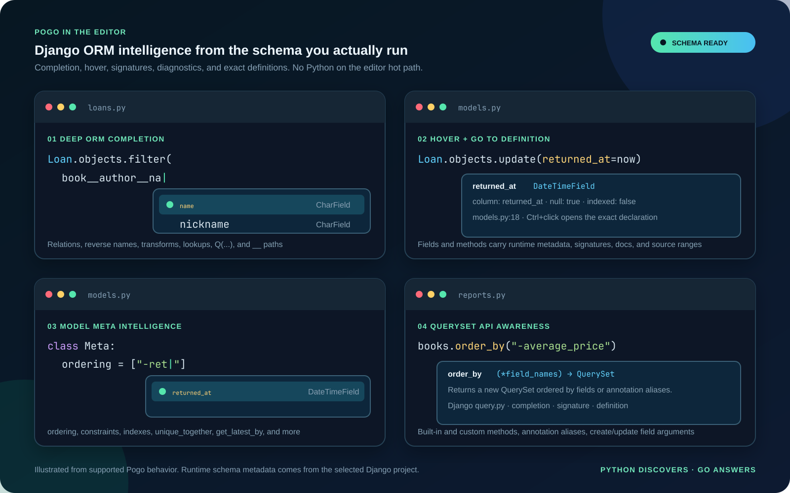
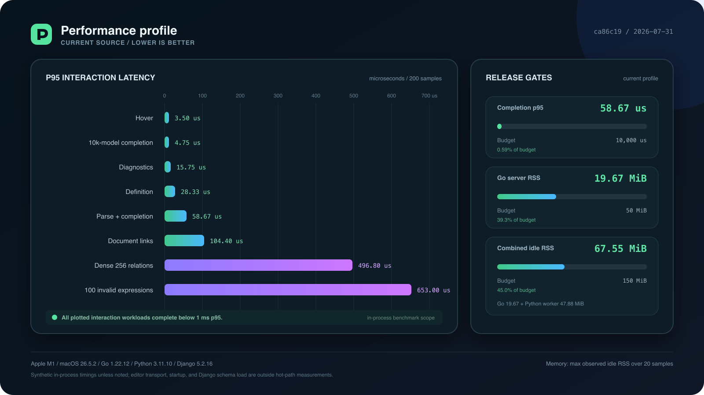
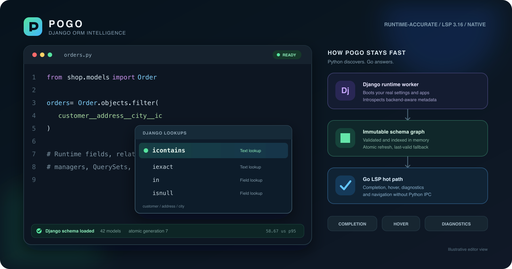
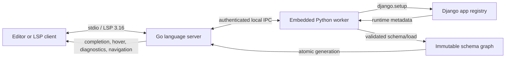

<p align="center">
  
</p>

<h1 align="center">The Django ORM language server</h1>

<p align="center">
  <strong>Write Django queries with the context your editor has been missing.</strong><br>
  Pogo reads the runtime schema from your real Django project, then delivers
  completion, hover, signature help, diagnostics, and exact navigation from a fast Go server.
</p>

<p align="center">
  <a href="https://github.com/amirhasanzadehpy/Pogo/actions/workflows/ci.yml"></a>
  <a href="https://github.com/amirhasanzadehpy/Pogo/releases/tag/v0.2.7"></a>
  
  
  
</p>

<p align="center">
  <a href="#quick-start"><strong>Get started</strong></a> |
  <a href="#feature-tour">Feature tour</a> |
  <a href="#performance">Performance</a> |
  <a href="#editor-setup">Editors</a> |
  <a href="#how-it-works">Architecture</a> |
  <a href="https://github.com/amirhasanzadehpy/Pogo/releases">Releases</a>
</p>

<p align="center">
  
</p>

<p align="center"><em>Runtime-aware Django help where you need it: inside queries, model metadata, and project APIs.</em></p>

## Why Developers Use Pogo

Django's real schema is created at runtime. Installed apps, abstract fields,
custom managers, `QuerySet` methods, database-specific lookups, reverse
relations, and project settings all affect what the ORM can do. Static stubs
alone cannot see the complete result.

Pogo gives your editor that missing runtime context:

- **Complete real ORM paths.** Follow fields, relations, reverse accessors,
  transforms, and lookups through any supported `__` chain.
- **Understand every field reference.** Hover and jump to definitions from
  filters, `Q(...)`, projections, updates, ordering, constraints, and `Meta`.
- **Explore the QuerySet API.** Get signatures, docs, completion, and Django
  source navigation for built-in methods alongside your custom methods.
- **Catch mistakes before the request runs.** See exact diagnostics for broken
  field paths, invalid lookups, and unsafe relation traversal.
- **Stay responsive.** Django discovers the schema in the background; warmed
  editor requests read only Pogo's immutable Go graph.

Pogo is designed to run beside Pyright, BasedPyright, Ruff, or another general
Python tool, not replace it.

## Feature Tour

| Capability | Django-aware behavior |
| --- | --- |
| **Completion** | Fields, foreign-key attnames, relations, reverse names, `Model.Meta` field options and constraints, related managers, lookups, transforms, managers, built-in and custom `QuerySet` methods |
| **ORM paths** | `filter`, `exclude`, `get`, `get_or_create`, `update_or_create`, `create`, `update`, `Q(...)`, expressions, ordering, projections, field masks, and related loading |
| **Hover** | Django field metadata plus built-in/custom QuerySet method signatures and docstrings |
| **Signature help** | Cached signatures and docstrings for manager and built-in or custom `QuerySet` methods |
| **Diagnostics** | Exact invalid path segments, non-relation traversal, invalid lookups, projections, and `select_related` targets |
| **Navigation** | Exact definitions for models, fields, relation strings, reverse accessors, managers, built-in or custom `QuerySet` methods, and individual path segments |
| **Schema refresh** | Debounced reloads, atomic graph replacement, and last-valid-schema fallback when a refresh fails |

## Quick Start

For VS Code, install one extension. The extension includes the matching Pogo
server for supported Linux, macOS, and Windows extension hosts on amd64/arm64.

### VS Code

Install **Pogo** from the
[VS Code Marketplace](https://marketplace.visualstudio.com/items?itemName=amirhasanzadehpy.pogo),
or run:

```sh
code --install-extension amirhasanzadehpy.pogo
```

No separate Pogo binary or `pogo.executablePath` setting is required. Reload VS
Code after installation and select the project's Python environment normally.

### Standalone Binary

For Neovim, Zed, another LSP client, or command-line use, download the archive for your OS and CPU from
[GitHub Releases](https://github.com/amirhasanzadehpy/Pogo/releases). Every
release includes Linux, macOS, and Windows builds for `amd64` and `arm64`, plus
`checksums.txt`.

The commands below use common architectures as examples. Replace `amd64` with
`arm64`, and `linux` with `darwin`, to match the archive you downloaded.

Linux and macOS archives contain one `pogo` executable:

```sh
tar -xzf pogo-v0.2.7-linux-amd64.tar.gz  # use darwin and/or arm64 when needed
mkdir -p "$HOME/.local/bin"
install -m 0755 pogo "$HOME/.local/bin/pogo"
export PATH="$HOME/.local/bin:$PATH"
pogo -version
```

Add `export PATH="$HOME/.local/bin:$PATH"` to `~/.profile`, `~/.zprofile`, or
your shell's equivalent to keep the command available after restarting.

Windows PowerShell:

The example uses `windows-amd64`; substitute `windows-arm64` in both commands on
Windows on Arm.

```powershell
Expand-Archive .\pogo-v0.2.7-windows-amd64.zip -DestinationPath .\pogo
$PogoBin = Join-Path $HOME ".local\bin"
New-Item -ItemType Directory -Force $PogoBin | Out-Null
Copy-Item .\pogo\pogo.exe "$PogoBin\pogo.exe"

$UserPath = [Environment]::GetEnvironmentVariable("Path", "User")
if (($UserPath -split ";") -notcontains $PogoBin) {
    [Environment]::SetEnvironmentVariable("Path", "$PogoBin;$UserPath", "User")
}
$env:Path = "$PogoBin;$env:Path"
pogo.exe -version
```

<details>
<summary>Download with GitHub CLI and verify checksums</summary>

This repository is private, so authenticate `gh` before downloading:

```sh
gh auth login
gh release download v0.2.7 \
  --repo amirhasanzadehpy/Pogo \
  --pattern 'pogo-v0.2.7-linux-amd64.tar.gz' \
  --pattern checksums.txt
sha256sum --check --ignore-missing checksums.txt
```

Change the `--pattern` target to match your OS and CPU. On macOS, download the
matching `darwin` archive and calculate its digest with
`shasum -a 256 pogo-v0.2.7-darwin-arm64.tar.gz` and compare it with the matching
line in `checksums.txt`. On Windows, use:

```powershell
Get-FileHash .\pogo-v0.2.7-windows-amd64.zip -Algorithm SHA256
```

</details>

### Open A Django Project

Open the trusted workspace containing `manage.py`, then open a Python file. By
default Pogo discovers:

- The workspace folder as the project root.
- VS Code's active Python environment, then the project's `.venv`, when using
  the extension and no Pogo interpreter override is set.
- An explicitly configured worker `DJANGO_SETTINGS_MODULE`, the literal setting
  in `manage.py`, or one unambiguous immediate `*/settings.py`.

The selected interpreter must already contain Django and every dependency your
project imports during `django.setup()`. Pogo does not select Python from an
ambient `VIRTUAL_ENV` or global `PATH`, and it does not use an ambient
`DJANGO_SETTINGS_MODULE`.

### Verify ORM Intelligence

Request completion while typing a relation path:

```python
from shop.models import Order

orders = Order.objects.filter(
    customer__address__city__icontains="York",
)
```

Pogo should complete each path segment, show field and lookup hover details,
navigate to model definitions, and diagnose misspelled paths.

## Everyday Usage

### Complete The ORM You Already Write

Pogo changes suggestions to match the API context:

```python
# Query names, transforms, and terminal lookups.
Order.objects.filter(customer__email__iexact=email)

# Projection paths.
Order.objects.values("customer__email", "total")

# Only single-valued relations are offered here.
Order.objects.select_related("customer__profile")

# Reverse accessors and collection relations are valid here.
Order.objects.prefetch_related("items__product")
```

Inside `@admin.register(Model)` admin classes, Pogo also follows
`super().get_queryset(...)` chains for related-loading completion and
navigation.

The VS Code extension retriggers suggestions after `__` is typed inside a
single-line Python string, working around VS Code's disabled-by-default quick
suggestions in strings.

Lookup suggestions come from the active Django field registry. Pogo also checks
the default database's JSON containment capability and omits `contains` and
`contained_by` when that backend does not support them.

### Catch Broken Paths Before Runtime

```python
# "adress" is reported as django-orm.unknown-path-segment.
Order.objects.filter(customer__adress__city="York")
```

Diagnostics use the exact UTF-16 range for the bad segment. Pogo also detects
non-relation traversal, invalid transforms or lookups, invalid projection
paths, and invalid `select_related` targets.

### Model Meta And QuerySet APIs

Pogo completes, hovers, and navigates to model fields inside Django `Meta`
options such as `ordering`, `unique_together`, `index_together`,
`get_latest_by`, `order_with_respect_to`, `UniqueConstraint(fields=[...])`, and
`Index(fields=[...])`. Ordering prefixes are preserved, so `"-tit"` completes
only the field portion.

```python
class Loan(models.Model):
    book = models.ForeignKey(Book, on_delete=models.CASCADE)
    borrower = models.CharField()
    returned_at = models.DateTimeField(null=True)

    class Meta:
        ordering = ["-returned_at"]
        constraints = [models.UniqueConstraint(fields=["book", "borrower"], name="unique_loan")]

# Field keywords, relation paths, and `Q(...)` paths have completion, hover,
# definition, and diagnostics.
Loan.objects.get_or_create(book=kindred, borrower="Grace", returned_at__isnull=True)
Loan.objects.filter(borrower="Ada", returned_at__isnull=True).update(returned_at=timezone.now())
Book.objects.filter(Q(author__name__icontains="ursula") | Q(published_year__gte=1970))

# Field-string methods support the same field intelligence.
Book.objects.annotate(average_price=Avg("price")).values("average_price").order_by("-average_price")[:1]
Book.objects.latest("published_at")
```

### Understand Project APIs

Built-in and custom manager/`QuerySet` methods are introspected but never
called. Hover shows their cached class, signature, and docstring; signature
help preserves positional-only, keyword-only, variadic, and keyword arguments.
Methods that return a new QuerySet retain model/path inference through literal
chains, while scalar, write, and iterator methods safely stop it.

### Navigate Schema-Backed Code

Go to definition works on model imports, fields, relation segments, reverse
accessors, managers, built-in and custom QuerySet methods, Meta field strings,
and static `ForeignKey`, `OneToOneField`, `ManyToManyField`, and `related_name`
strings. Navigation includes the exact target range when its source remains
current.

### Refresh Without Blocking Editing

Saving Python under an installed Django app schedules a trailing-edge schema
refresh. A valid generation replaces the graph atomically. If Django fails to
reload, Pogo keeps the last valid graph and warns once, so editor features stay
available while you fix the project error.

On POSIX systems, the production server also keeps the last accepted runtime
snapshot in Pogo's private operating-system user cache. On a later launch, a
matching identity can publish that validated, potentially stale snapshot
provisionally before Django finishes starting. Pogo still starts Python and
verifies the project in the background;
the authoritative runtime graph atomically replaces the provisional generation,
while a startup failure leaves the provisional graph available with the normal
stale-schema warning. Cache identity covers the project, interpreter identity,
settings, complete snapshotted worker environment, coordinator `PATH`, worker
and schema formats, and reported schema-source file identities. Cache filenames
contain only a digest, not environment values.

This improves eligible repeat launches on POSIX only; persistence is currently
disabled on Windows. The first launch has no cache to read, and malformed,
stale, oversized, non-private, unavailable, or incomplete-identity/manifest
entries are treated as misses without suppressing normal Django startup. The
manifest covers bounded imported project-root modules, not external package
contents, so mandatory runtime verification is the source of authority. Editor
feature handlers never access the filesystem or Python.

## Editor Setup

| Editor | Integration | Status |
| --- | --- | --- |
| **VS Code** | Bundled language-client extension | First-party; one Pogo process per workspace folder |
| **Neovim 0.11.3+** | Built-in LSP API | Direct configuration; no separate Pogo plugin required |
| **Zed** | External command through a registered Python adapter | Temporary bridge until a native adapter exists |

### VS Code

Automatic discovery is enough for standard projects. For an unusual layout,
add only the required overrides to `.vscode/settings.json`:

```json
{
  "pogo.pythonPath": ".venv/bin/python",
  "pogo.settingsModule": "config.settings",
  "pogo.envFile": ".env.pogo",
  "pogo.environment": {
    "APP_MODE": "development",
    "DEBUG": null
  }
}
```

Relative paths resolve from each workspace folder. The extension sends the
absolute environment-file path to Pogo and never reads or sends its contents.
No `.env` variant is discovered automatically. The worker starts with no
ambient application variables, loads the file, then applies
`pogo.environment`; a string replaces a file value and `null` removes it.

Keep secrets in an ignored, permission-restricted `.env.pogo`, and commit a
value-free `.env.pogo.example` that documents required keys. On POSIX, Pogo
warns when the selected environment file is group- or world-readable. File
contents are snapshotted when the Pogo manager starts, so restart the client or
reload the window after editing the file. Literal `pogo.environment` values
cross LSP initialization and can appear in LSP traces; use them only for
nonsecret configuration.

Pogo does not synthesize a `SECRET_KEY`, database URL, settings module, or
fallback database. The worker inherits only the coordinator's snapshotted
`PATH` so ordinary project imports can locate tools such as Git. An explicit
worker `PATH` replaces that default. The worker does not inherit
`VIRTUAL_ENV`, `PYTHONPATH`, `PYTHONHOME`, proxy, locale, cloud, database, or CI
variables from VS Code.

Remote SSH, WSL, Dev Containers, and Codespaces run Pogo on the remote extension
host. VS Code installs the extension and uses its matching bundled binary there.

### Neovim

With current `nvim-lspconfig`:

```lua
vim.lsp.config("pogo", {
  cmd = { "pogo" },
  filetypes = { "python" },
  root_markers = { "manage.py", "pyproject.toml", ".git" },
})

vim.lsp.enable("pogo")
```

Use `init_options.djangoOrm.pythonPath`,
`init_options.djangoOrm.settingsModule`,
`init_options.djangoOrm.environmentFile`, and
`init_options.djangoOrm.environment` for explicit project configuration. Run
`:checkhealth vim.lsp` to inspect the active root, command, and logs. Environment
file paths sent by other clients are resolved against the project root by Pogo.

<details>
<summary>Zed bridge configuration</summary>

Zed cannot currently register a new language-server adapter from
`settings.json`. The available bridge replaces the command behind its `pyright`
slot with Pogo:

```jsonc
{
  "languages": {
    "Python": {
      "language_servers": ["pyright", "basedpyright", "..."]
    }
  },
  "lsp": {
    "pyright": {
      "binary": {
        "path": "/home/you/.local/bin/pogo",
        "arguments": [
          "-python", "/absolute/path/to/project/.venv/bin/python",
          "-settings", "config.settings"
        ]
      }
    }
  }
}
```

This starts Pogo, not Pyright, in that slot. Keep another registered Python
server such as BasedPyright enabled for general typing. Use escaped backslashes
for Windows JSON paths and restart language servers after changing arguments.

</details>

## Performance

<p align="center">
  
</p>

The current reference profile keeps every plotted interaction workload below
`1 ms` p95, including dense relation completion and a batch of 100 invalid
expressions. Larger document-update and snapshot workloads are measured
separately in the full profile.

| Workload | Scope | p95 |
| --- | --- | ---: |
| Hover | Loaded-cache handler | `3.50 us` |
| Completion in a 10,000-model graph | Selected imported model; graph already built | `4.75 us` |
| Diagnostics | Incremental edit, parse, analysis, and publish | `15.75 us` |
| Definition | Loaded-cache handler | `28.33 us` |
| Completion | Incremental edit, parse, and handler | `58.67 us` |
| Dense relation completion | 256 completion candidates | `496.80 us` |
| Diagnostic scale | 100 invalid ORM expressions | `653.00 us` |

| Release gate | Observed | Budget |
| --- | ---: | ---: |
| Completion p95 | `58.67 us` | `< 10,000 us` |
| Go server idle RSS | `19.67 MiB` | `<= 50 MiB` |
| Combined Go + Python idle RSS | `67.55 MiB` | `<= 150 MiB` |

Reference profile: tracked source at `ca86c19`, captured July 31, 2026 on an
Apple M1 with macOS 26.5.2, Go 1.22.12, Python 3.11.10, and Django 5.2.16.
Timings are synthetic in-process benchmarks with 200 samples unless stated
otherwise; editor transport, process startup, and Django schema loading are not
included. Memory is the maximum observed idle RSS over 20 aligned samples, not
process-lifetime peak memory. Results vary by machine and project.

Run the same release-gated profile locally with `make fixture-env` followed by
`make bench`. See [Performance Profiles](DEV.md#performance-profiles) for the
full matrix, methodology, profiling commands, and CI artifact layout.

## How It Works

<p align="center">
  
</p>



1. The editor initializes Pogo with a project root and optional interpreter,
   settings, environment-file path, and nonsecret environment literals.
2. On POSIX, Pogo may publish a matching, checksum-validated provisional graph from
   the private user cache, then extracts its embedded Python worker into a
   private temporary directory
   and starts it with a random 256-bit authentication token and an explicit,
   isolated process environment.
3. The worker runs Django and returns fields, relations, managers, custom
   methods, indexes, constraints, source ranges, and backend-aware lookups.
4. Go strictly validates the payload, builds indexed immutable views, atomically
   replaces any provisional generation, and privately persists the accepted
   non-superseded raw snapshot for a later launch.
5. Editor features read that graph directly. Python returns only for a schema
   refresh, not for each completion or hover request.

Unix systems use a private mode-0600 Unix socket. Windows uses authenticated
loopback TCP. IPC authentication protects the local endpoint; it is not a
sandbox for project code.

## Compatibility And Scope

| Python | Django 4.2 | Django 5.2 |
| ---: | :---: | :---: |
| 3.10 | Tested | Tested |
| 3.11 | Tested | Tested |
| 3.12 | Tested | Tested |
| 3.13 | Not supported upstream | Tested |

Release binaries target Linux, macOS, and Windows on `amd64` and `arm64`.

Pogo deliberately favors false negatives over false positives. It recognizes
direct, aliased, and qualified model imports; model constructors; assignments;
model annotations; `QuerySet[Model]`; selected manager/query chains; and
annotated parameters. Dynamic filters, `**kwargs`, f-strings, concatenated
paths, unresolved receivers, and unsafe rebinding are generally left alone.

Pogo does not provide general Python typing, rename, references, formatting,
imports, code actions, or workspace symbols. Keep your existing Python language
server and formatter enabled.

## Configuration

| Need | VS Code | LSP initialization | CLI |
| --- | --- | --- | --- |
| Project root | Workspace folder | `djangoOrm.projectRoot` | `-project PATH` |
| Python interpreter | `pogo.pythonPath` | `djangoOrm.pythonPath` | `-python PATH` |
| Settings module | `pogo.settingsModule` | `djangoOrm.settingsModule` | `-settings MODULE` |
| Worker environment file | `pogo.envFile` | `djangoOrm.environmentFile` | `-worker-env-file PATH` |
| Worker environment literals | `pogo.environment` | `djangoOrm.environment` (`string` or `null` values) | Not accepted on the CLI |
| Logs | Pogo output channel | Client stderr | `-log-file PATH` |

<details>
<summary>Automatic resolution order</summary>

Project root:

1. `-project`
2. `djangoOrm.projectRoot`
3. The sole workspace folder
4. LSP `rootUri`
5. Legacy `rootPath`

Python interpreter:

1. `-python`
2. `djangoOrm.pythonPath`
3. Project-local `.venv`
4. Actionable configuration error

Worker environment file:

1. `-worker-env-file`
2. `djangoOrm.environmentFile`
3. No file; Pogo never auto-discovers `.env` variants

Relative environment-file and interpreter paths resolve against the project
root. Explicit absolute environment files may be outside the project.

Django settings:

1. `-settings`
2. `djangoOrm.settingsModule`
3. `DJANGO_SETTINGS_MODULE` from the explicitly merged worker environment
4. A literal `os.environ.setdefault(...)` value in `manage.py`
5. One unambiguous immediate `*/settings.py`

An explicit settings value that conflicts with the explicitly merged worker
`DJANGO_SETTINGS_MODULE` fails configuration. Equal values are accepted.
Ambiguous settings fail with an actionable error instead of an arbitrary guess.

Worker environment precedence:

1. Coordinator `PATH` as the only inherited baseline variable
2. Explicit environment file
3. `djangoOrm.environment` literals, where `null` removes a file value
4. Pogo-owned Python, private temp, platform, and authenticated transport values

Reserved Pogo runtime keys cannot be overridden. The file and literal map are
validated and snapshotted once per manager, so retries and schema refreshes use
the same values until Pogo restarts.

</details>

## Troubleshooting

| Symptom | Check |
| --- | --- |
| VS Code cannot start bundled Pogo | Reinstall the VSIX and confirm the extension host uses supported Linux, macOS, or Windows on amd64/arm64; custom builds may set an absolute executable path |
| ORM results are empty | Confirm the selected interpreter can import Django, the project, and its dependencies; inspect the Pogo log for a missing explicit worker variable |
| Results are stale after a save | Check the Pogo output/log for a failed Django refresh; the last valid graph remains active |
| Python interpreter is not found | Create the project `.venv` or set an explicit interpreter; ambient `VIRTUAL_ENV` and global Python are intentionally ignored |
| Environment-file edit has no effect | Restart the Pogo client or reload the editor; the file is snapshotted once, not reread on refresh |
| Django needs a native library or proxy | Explicitly configure the required native-library path, certificate/proxy variables, or locale; ordinary subprocess lookup uses the coordinator `PATH` automatically |
| Multiple projects in one window | Use one LSP root per project; VS Code creates one client per workspace folder automatically |

If Gatekeeper blocks a verified standalone macOS binary, approve it in **System
Settings > Privacy & Security** or remove its quarantine attribute after
checking its digest. The VS Code extension does not depend on a shell-installed
Pogo executable.

## Build And Contribute

Building from source requires Git, Go 1.22 or newer, Python 3.10-3.13, and GNU
Make on Linux or macOS:

```sh
git clone https://github.com/amirhasanzadehpy/Pogo.git
cd Pogo
make fixture-env
make build
make test
./build/pogo -version
```

Useful development gates:

```sh
make test-race      # race-enabled Go suite
make compat         # pinned Django 4.2 and 5.2 fixtures
make bench          # profile plus release performance gates
make release-check  # inspect production dependencies and embedded imports
```

| Directory | Responsibility |
| --- | --- |
| `cmd/pogo` | CLI, configuration, logging, and server wiring |
| `internal/lsp` | LSP lifecycle, capabilities, handlers, diagnostics, and navigation |
| `internal/analysis` | Tree-sitter parsing, document state, model inference, and ORM paths |
| `internal/schema` | DTO validation, indexed graph views, and atomic cache generations |
| `internal/python` | Worker supervision, authentication, refresh, and transport |
| `src/daemon` | Embedded Django introspection worker |
| `client/vscode` | First-party VS Code language client |

See [DEV.md](DEV.md) for protocol traces, schema inspection, fuzzing,
performance profiling, release inspection, and versioning.

## Security

Pogo starts Django, and `django.setup()` imports and executes code from the
project. The Go coordinator may naturally inherit its editor or shell
environment for normal process operation. Pogo forwards only a snapshotted
`PATH` for ordinary subprocess lookup, not ambient application variables. The
worker otherwise receives explicit project values and Pogo-owned runtime values; it receives no
ambient `VIRTUAL_ENV`, Python/Django settings, cloud, database, CI, locale, or
proxy configuration.

This isolation is not an OS sandbox. Trusted project code still runs with the
user's access to files, user-site packages, databases, services, and the
network, and can discover information through those capabilities. Use Pogo only
with trusted workspaces. The VS Code extension is disabled in untrusted and
virtual workspaces. Put secrets in a protected environment file rather than
literal LSP initialization values or command-line arguments.

## Releases

Version tags are built only after the complete compatibility, race, native
transport, cross-build, and performance matrix passes. CI publishes six binary
archives, a VS Code VSIX containing those six binaries, generated release notes, and `checksums.txt` to
[GitHub Releases](https://github.com/amirhasanzadehpy/Pogo/releases). The same
VSIX is published to the
[VS Code Marketplace](https://marketplace.visualstudio.com/items?itemName=amirhasanzadehpy.pogo).

For bugs and feature requests, use
[GitHub Issues](https://github.com/amirhasanzadehpy/Pogo/issues).
